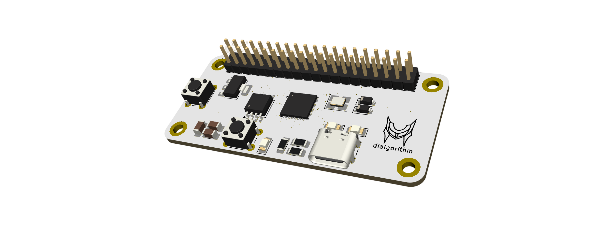
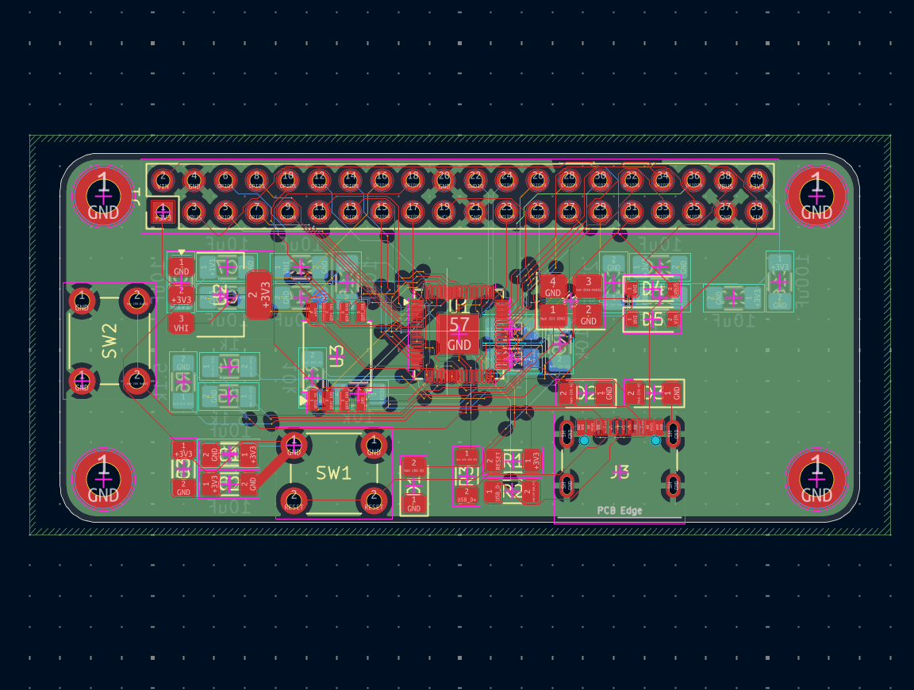
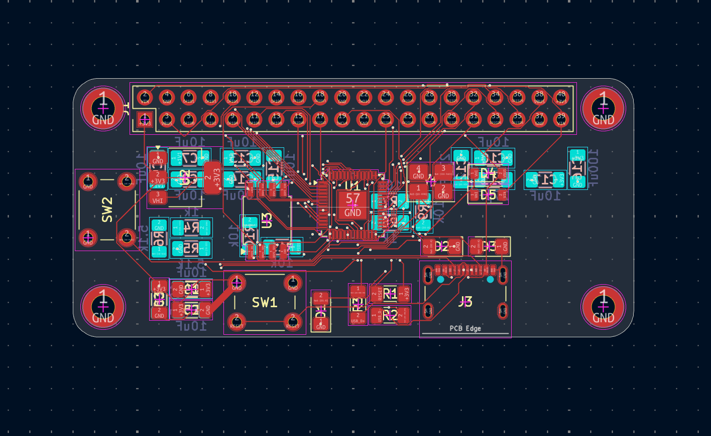
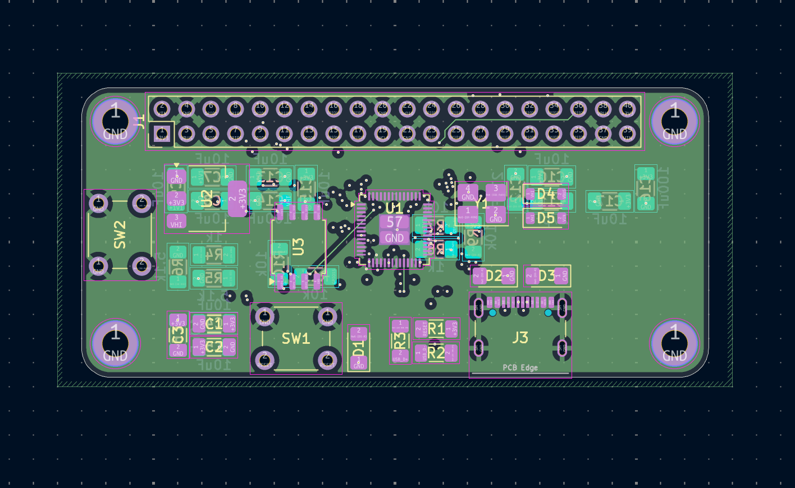
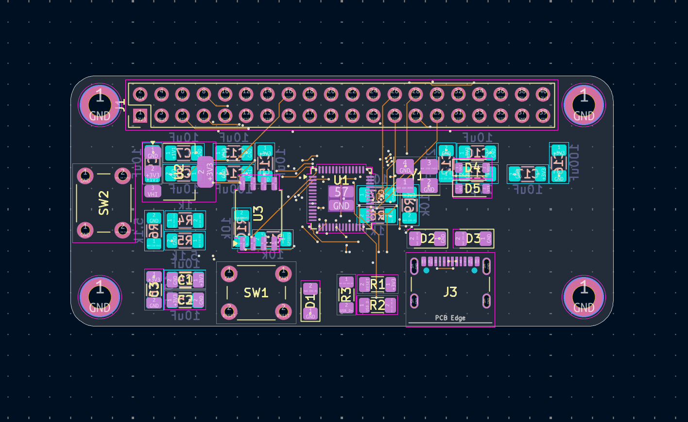
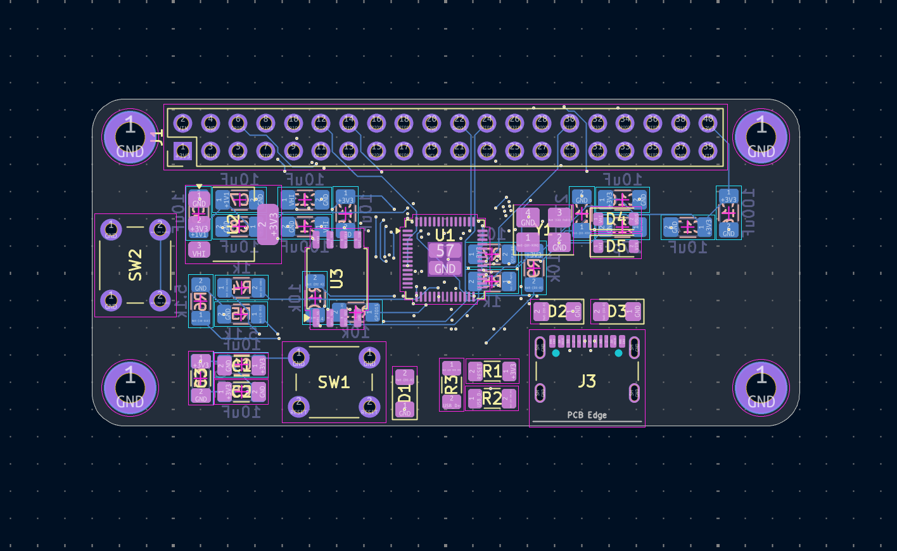

<h1 align="center">
  anorith
   
</h1>

<h4 align="center">
  a minimal rp2040 dev board with usb-c and onboard qspi flash.
</h4>

## it features

- **RP2040** dual-core microcontroller as the main processor
- **W25Q16JVSS** 16 mbit qspi flash for program storage
- **reset and boot** buttons for flashing and resetting
- **status LEDs** for power and I/O indication

## design

**anorith** is a small, self-contained RP2040 board built around a compact 4-layer stackup.

the board is centered on the **rp2040**, with a **w25q16jvss** QSPI flash chip providing onboard storage for firmware, and an **ams1117-3.3** regulating the 3.3 V rail from USB. a **12 MHz crystal** clocks the RP2040, and a pair of schottky diodes handle power-path switching between usb and the header supply. the **usb-c connector**, **reset button**, and **boot button** sit along the board edge for easy access during programming.

## schematics + pcb design

| schematic                           | pcb                    |
| ----------------------------------- | ---------------------- |
|  |  |

| first layer                         | second layer                  |
| ----------------------------------- | ----------------------------- |
|  |  |

| third layer                         | fourth layer                  |
| ----------------------------------- | ----------------------------- |
|  |  |

## BOM

the complete bill of materials is available in [`bom.csv`](bom.csv).
